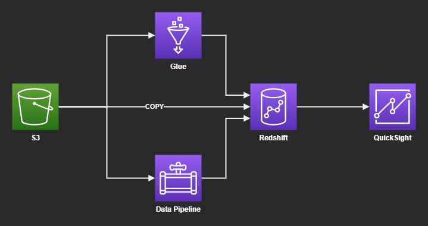
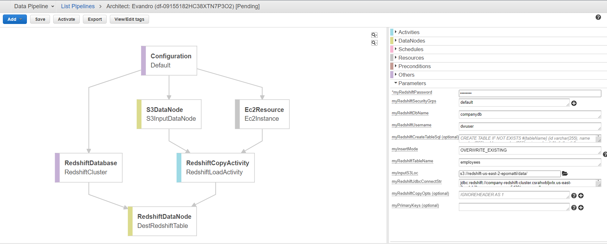

# AWS Redshift

Sample of CSV data ingestion from S3 to Redshift.



## Redshift

Create the infrastructure:

```
terraform init
terraform apply -auto-approve
```

Once done, connect to the Redshift Query Editor v2, and copy the CSV to the table:

```sql
copy products from 's3://<your-bucket-name>/data/products.csv' 
credentials 'aws_iam_role=arn:aws:iam::<aws-account-id>:role/<role-name>'
csv;
```

A ready-to-use command line is printed to the TF outputs. After that you should [Vacuum and analyze the database](https://docs.aws.amazon.com/redshift/latest/dg/tutorial-loading-data-vacuum.html):

> Whenever you add, delete, or modify a significant number of rows, you should run a VACUUM command and then an ANALYZE command. A vacuum recovers the space from deleted rows and restores the sort order. The ANALYZE command updates the statistics metadata, which enables the query optimizer to generate more accurate query plans.

```sql
vacuum;
analyze;
```

You should now be able to select data with high performance:

```sql
select * from public.products;
```

### Spectrum

You may also use Spectrum to read files directly from S3 on Redshift.

### Glue

For an example of using Glue, check my other repository [aws-glue-athena](https://github.com/epomatti/aws-glue-athena).

## Data Pipelines

You can also create a Data Pipeline and periodically ingest data:




---

### Clean-up

```sh
terraform destroy -auto-approve
```